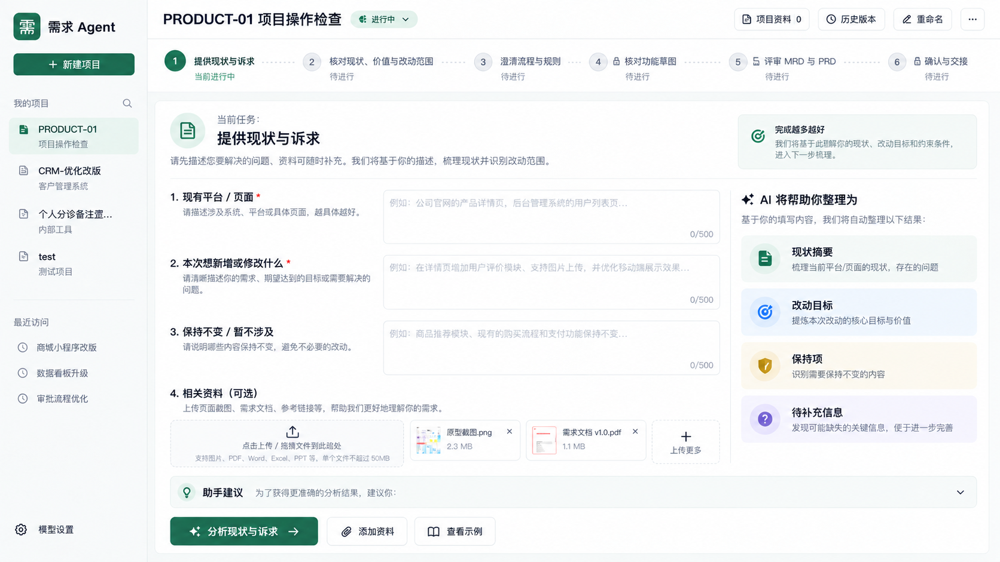
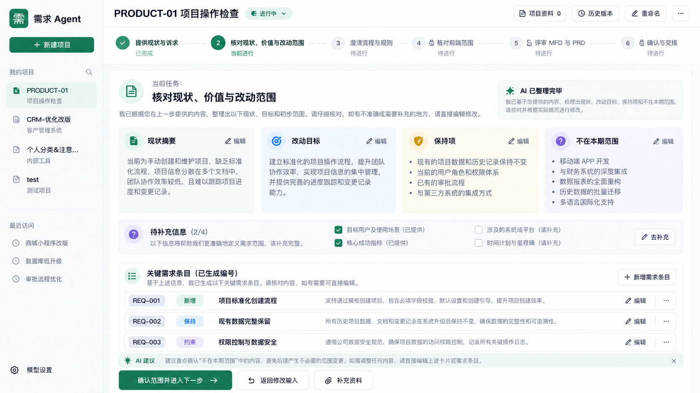
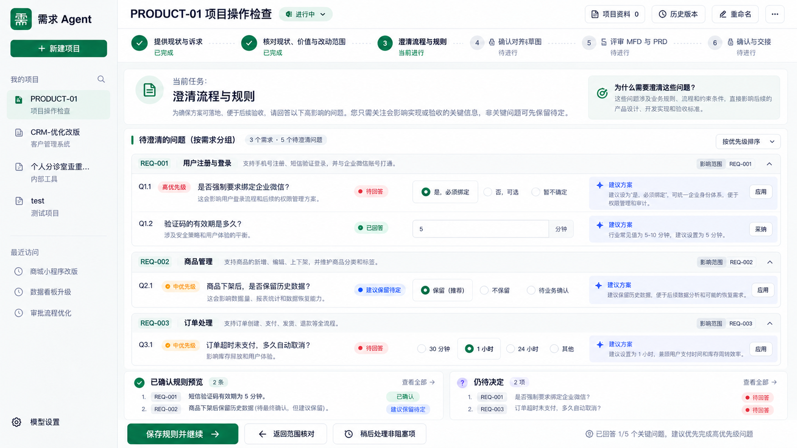
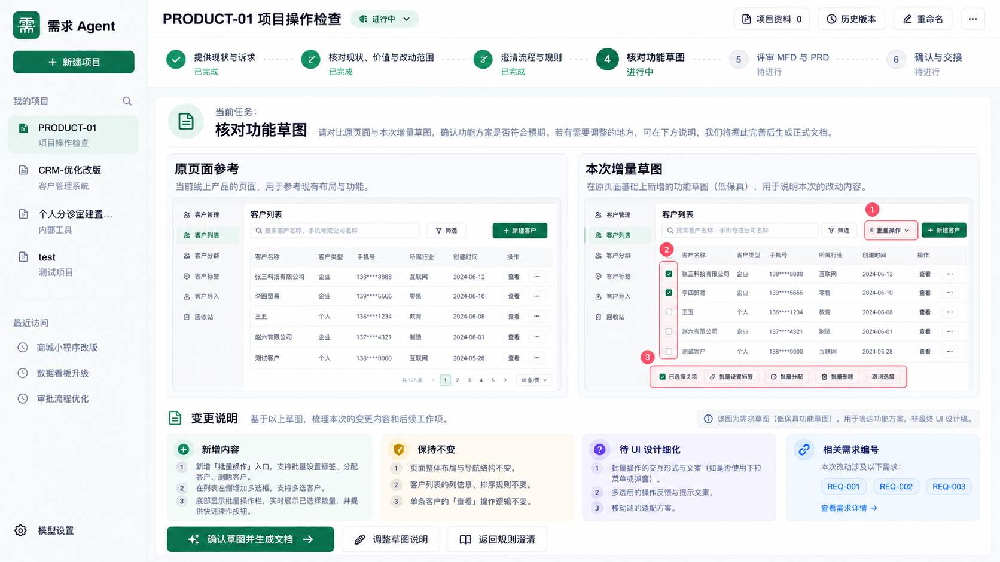
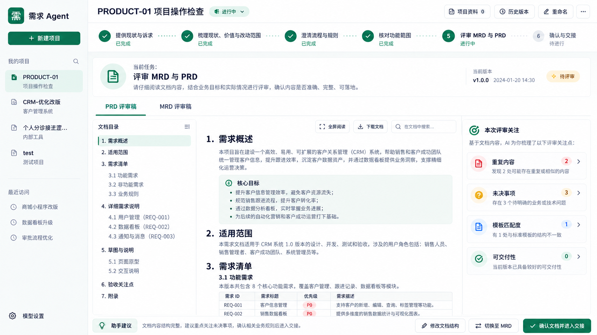

# 需求 Agent：工作流 UI 设计交接与续设计说明

> **交接版本：0.9｜整理日期：2026-09-25｜目标工程：requirements-agent**  
> **本轮重点：用户如何完成需求收集与澄清，而不是继续优化 MRD／PRD 的写作算法。**  
> 本包包含五张已生成的概念设计图及配套说明。第六步、关键异常状态和部分辅助界面尚未出图，不能把本包表述为“全部页面已定稿”或“产品已验收”。

## 0. Codex 从这里开始

本说明用于接续本次对话的 UI 设计，并在现有应用上实现。先读本文，再按顺序查看 `assets/` 中的五张图；不要只看图片重画一个演示应用，也不要只读文字保留原来的双入口操作台。

**本轮目标**：产品经理从现有平台截图和零散诉求出发，在一个清楚的主工作区里完成“提供资料 → 核对现状与范围 → 澄清规则 → 核对功能草图”，之后再评审 MRD／PRD 并确认交接。使用者不需要判断“现在该填写中间表单，还是去右边找需求助手”。

**工程定位线索，实施时重新核对**：

| 项目 | 交接信息 |
| --- | --- |
| 仓库 | `whj1677/requirements-agent` |
| 本机工作区参考 | `D:\01_AI工程\01_工程项目\pm-req` |
| 既有工作分支参考 | `codex/ui-02-guided-workflow` |
| 既有 PR 参考 | `#2` |
| 运行环境 | 本包不指定当前 PID、运行 SHA 或可直接操作的服务；由本机执行者核对 |
| 不属于本任务 | `ui-test-agent`、AUTH、其他项目服务 |

本文件不证明远端或本机仍停在某个旧提交，也不授权回退、切换分支或覆盖现有工作。沿实际有效工作线推进，保留用户未提交修改。

### 0.1 内容来源与效力

为了避免把概念图的占位内容变成产品规则，本文分清三层：

| 标识 | 含义 | 使用方式 |
| --- | --- | --- |
| **既定方向** | 用户在对话中明确的产品目标和边界 | 作为实施约束，例如顺序工作流、MRD／PRD 都保留、需求编号稳定、业务草图低保真 |
| **图示已有** | 这五张概念图实际显示的布局和组件 | 作为视觉与页面职责参考，不证明后端已实现，不赋予示例业务任何效力 |
| **交接补充／待续设计** | 为可实施性补充的行为、状态、尺寸建议及图中矛盾处理 | 明确记录后实现；涉及产品范围、业务决定或主要视觉变化时集中核对，不冒充已由用户逐项批准 |

**冲突处理原则**：已明确的产品与安全边界优先于概念图中的占位文案。本文的“图示修正清单”列出这些冲突，不偷偷修改原图。对于无法由现有边界决定的事项，提出推荐方案并保留待核对状态，不自行补造业务批准。

### 0.2 本包目录

```text
requirements-agent-ui-handoff/
├── UI_DESIGN_HANDOFF.md       # 权威交接正文，Codex 优先读取
├── UI_DESIGN_HANDOFF.html     # 同文图文阅读版，可直接在浏览器打开
├── assets-manifest.json       # 原图身份、尺寸与 SHA-256
└── assets/
    ├── 01-intake.png
    ├── 02-scope-review.png
    ├── 03-rules-clarification.png
    ├── 04-sketch-review.png
    └── 05-document-review.png
```

原图均未修改。HTML 是交接说明的阅读副本，不是可运行产品或交互原型。第一步曾有一个早期的独立右侧说明栏版本，本包选用后续整合到主任务卡内的版本，不同时提供两个相互竞争的实施基准。

---

## 1. 本轮做什么、不做什么

### 1.1 必须实现的体验变化

| 从当前问题出发 | 目标体验 |
| --- | --- |
| 中间填表、右侧聊天都能提交和整理 | 一份任务输入、一处当前结果、一条主要推进路径 |
| 所有阶段看起来都能点，失败后才知道缺条件 | 进入前说明当前步骤及前置缺口；可查看不等于可执行 |
| 尚未整理就展示大片空白核对表 | 先输入，分析后展示已整理结果，用户只纠错、补缺和决定 |
| AI 助手不知道何时使用 | AI 嵌入分析、澄清、局部修改；辅助对话绑定当前对象 |
| 先填核对说明，再往下找草图或文档 | 结果在前，解释和差异随后，核对操作靠近结果 |
| 生成文件即被理解为需求已批准 | 保存、分析完成、阶段核对、正式确认分别表达 |

**这不是换一个配色主题。** 导航、主按钮、内容状态和推进规则需要一起调整，复用已有服务端能力，不用漂亮空页面替代真实流程。

### 1.2 明确不扩入本轮

本轮保留第五步文档阅读和第六步交接，但不以改进成文算法、DSH 接入、模板评分引擎为主要工作。没有现成检查能力时显示“未检查”，不为填满设计图临时开发一整套文档审查平台。

不建设高保真业务 UI 设计器、通用审批平台、完整需求管理平台、测试执行平台或新的业务系统。已有编号与关联能力必须保留，但不因图片使用 `REQ-001` 就重做编号体系。

---

## 2. 设计图索引与完整性

| 页面 | 页面名称 | 设计图 | 当前可交接程度 |
| --- | --- | --- | --- |
| P01 | 提供现状与诉求 | `assets/01-intake.png` | 主布局概念已给出，加载／结果／失败状态需补齐 |
| P02 | 核对现状、价值与改动范围 | `assets/02-scope-review.png` | 有内容状态已给出，来源核对／局部编辑需细化 |
| P03 | 澄清流程与规则 | `assets/03-rules-clarification.png` | 问题分组布局已给出，回答状态与门禁需按文字纠正 |
| P04 | 核对功能草图 | `assets/04-sketch-review.png` | 对照阅读布局已给出，图内业务画面仅为示例 |
| P05 | 评审 MRD 与 PRD | `assets/05-document-review.png` | 阅读布局已给出，真实状态与动作语义需补齐 |
| P06 | 确认与交接 | **尚无设计图** | 本文仅提供续设计要求，不宣称已完成视觉设计 |

五张原图均为 **1672 × 941 像素**。它们是概念图，不是浏览器实测截图，且各页展示的项目、业务需求和计数并不连续，不能串成一条已验证的业务样例。

另待补：项目进入／创建、资料抽屉、需求详情、局部 AI 修改、缺失前提、加载与失败、上游变化、未保存退出，以及较窄桌面宽度的呈现。

---

## 3. 全局框架与视觉规范

### 3.1 图示已有：三层页面结构

**第一层：项目侧栏。** 品牌、创建项目、项目切换、设置。侧栏不重复加入六个工作流入口；项目列表与流程导航分工明确。

**第二层：项目头部与步骤条。** 项目名称、真实状态、资料入口、历史版本及低频操作。下面是六步进度。重命名和更多操作不得抢占当前任务的视觉优先级。

**第三层：当前任务工作区。** 本步标题、简短说明、主要输入或结果、必要缺口、当前主要操作。默认不展示永久通用聊天栏。

图内“AI 将帮助你整理为”“建议方案”“本次评审关注”是特定任务的说明或检查内容，不是第二套输入系统。可以在宽屏侧置，但必须属于本步，不能演变为所有页面都常驻的通用助手。

### 3.2 交接补充：布局与样式起始值

下表是实现建议，不是从图片精确量取的设计源文件参数。优先复用工程现有样式变量，并在浏览器里核对，不把原图整体缩放成固定尺寸网页。

| 项目 | 建议起始值 |
| --- | --- |
| 桌面设计核对宽度 | 1440、1280、1024 像素 |
| 项目侧栏 | 宽屏约 240 像素；较窄时收窄或可折叠 |
| 项目头部 | 约 64 像素；长项目名省略但可查看完整名称 |
| 流程条 | 约 80–96 像素；窄屏可显示“第 n／6 步”及展开步骤列表 |
| 主内容间距 | 外边距 24，卡片间距 16，局部间距 8 像素为起点 |
| 正文与次要文字 | 正文约 16，次要说明不宜小于 14 像素 |
| 主操作与输入 | 按钮约 44 像素高；焦点状态清楚，文本输入可自增高 |
| 视觉基调 | 墨色文字、白底、浅灰分区、克制的绿色主色 |
| 可用色值起点 | 主色 `#166B55`；正文 `#17212B`；底色 `#F5F7F6`；分隔 `#DDE5E1` |
| 卡片 | 约 12 像素圆角、轻边框；不靠强阴影和大片彩色装饰区分所有内容 |
| 字体 | 沿用可用中文系统字体；不依赖随包分发字体文件 |

状态不能仅用颜色表达；同时提供图标或文字。较长编号、中文名称、未知状态和错误提示必须可读。低频控件可收纳，但原有资料、历史、导出等入口不能因为简化界面而消失。

### 3.3 滚动与操作位置

普通步骤尽量只有一个主要纵向滚动区域，避免中间、右边、卡片内部同时滚动。长文阅读器、图片预览和抽屉可以有独立滚动，但退出后恢复原页面位置和焦点。

主要操作区建议位于内容末尾，并在长内容页面使用不遮挡正文的固定底栏。底栏说明未保存或缺失条件；不能只留下一个无解释的灰色按钮。

窄屏优先将原图／草图和说明卡上下排列，文档目录可折叠，不把所有栏位压缩成不可读的小字。800 像素及以下的完整适配尚未出图；不自动扩展成独立移动端产品。

---

## 4. 工作流状态与动作边界

### 4.1 三类状态必须分开

| 状态维度 | 示例 | 不得等价成什么 |
| --- | --- | --- |
| 本地输入 | 未修改、有未保存修改、保存中、已保存 | 点击了选项不等于服务端已经保存 |
| 系统任务 | 未开始、处理中、成功、部分结果、失败、受预算或授权阻塞 | 模型成功不等于阶段已核对 |
| 阶段与内容 | 前置条件未满足、可以开始、进行中、待用户核对、已核对、需重新核对 | 阶段已核对不等于正式需求基线已批准 |

这些是前台表达建议，应映射到实际后端对象，不强行增加一套相互矛盾的真相源。服务端暂时读不到状态时显示“状态暂无法确认”，不能用零条记录代替失败响应并开放新动作。

### 4.2 六步主要动作表

| 步骤 | 当前主要内容 | 主动作建议 | 下一步的必要依据 |
| --- | --- | --- | --- |
| 1 | 零散诉求和相关材料 | 分析现状与诉求 | 输入对象与意图可识别；分析或读取限制明确 |
| 2 | 现状、范围、保持项与需求清单 | 确认范围并继续 | 本阶段关键范围已核对；未决范围有明确处理 |
| 3 | 按需求分组的关键问题及回答 | 有未保存回答时“保存回答”；条件齐全后“核对规则并继续” | 阻塞本期功能的关键问题已解决或范围已明确调整 |
| 4 | 原页面、功能草图与变化说明 | 确认草图并继续 | 当前草图对应当前需求；适用性与业务影响明确 |
| 5 | MRD／PRD 的实际内容和评审状态 | 完成文档评审并继续 | 两份要求交付的文档对应有效内容；本步评审条件满足 |
| 6 | 指定版本、关键结论和交接范围 | 确认此需求版本；确认成功后再开放生成／取得交接包 | 真实人工确认记录及服务端门禁通过 |

**补充约定**：第一步分析完成可以引导到第二步核对，不代表自动批准分析结论。不要在第一、第二步要求用户对同一段现状连续做两次没有区别的确认；如已有后端需要两类记录，前台应分别说明“提交输入”和“核对理解”的真实含义。

### 4.3 不能被“继续”夹带的行为

确认当前阶段，不自动采纳所有候选需求；选择讨论方向，不自动修改关联条目；确认草图，不自动触发新的付费成文；切换文档，不自动记录已评审；下载草稿，不自动生成正式基线。

需要模型调用时，沿既有授权与预算界面明确本次动作。用户刚刚确认内容，不代表同时批准新的外发或预算。若已有有效授权，可按真实范围复用，不重复索取密钥，也不借用已经耗尽的试跑额度。

### 4.4 返回修改与受影响范围

返回历史步骤先显示其内容和核对版本。实质修改保存后，由实际依赖关系标记受影响的后续成果，给出“哪些需要重新核对、为何需要”的列表。保留旧草图和旧文档的只读查看，不能覆盖或伪造为当前版本。

不确定影响范围时如实说明，不能默认为全部不受影响；也不要因为改了无关展示文字就机械重跑所有模型阶段。

---

## 5. P01：提供现状与诉求



*图示已有：单一主任务卡、三个引导输入区、附件区、只读的 AI 预期结果说明及一个绿色分析按钮。图内字段限制、文件类型、文件大小和业务例子均为占位。*

### 5.1 页面职责

帮助用户开始，而不是要求用户先替 Agent 整理完整需求。首屏应明确：“先说你知道的，相关截图可以一起加；系统分析后再提示缺什么。”

保留图里的平台／页面、改动诉求、保持项三个引导角度；它们属于**同一份输入**，不能在右侧再问一遍。

**交接补充**：以“本次想新增或修改什么”为核心输入。用户把平台和约束一并写进这段文字时，不因两个辅助字段为空机械拦截；可以由分析提取后在 P02 核对。辅助背景和保持项允许展开补充，不强制用户为了格式重新搬运文字。若这涉及现有必填规则改变，记录为产品规则调整并同步后端。

### 5.2 页面从空态到结果的行为

| 状态 | 页面表现 | 操作 |
| --- | --- | --- |
| 未输入 | 引导文案、核心输入、资料上传；不显示“本步核对”空表 | 分析不可执行时说明“请先描述本次需求或添加相关材料” |
| 有未保存输入 | 明确本地编辑状态，显示待上传／已入项目的资料区别 | 提交时保存真实输入，再按授权启动分析 |
| 分析中 | 显示真实任务阶段，例如“正在理解页面”；保留输入只读查看 | 防重复提交；没有真实进度来源就不显示假百分比 |
| 有部分结果 | 展示已取得内容和未读材料，不标记“资料已全部理解” | 允许查看结果；是否继续由缺口影响决定 |
| 分析完成 | 摘要式展示“已整理，可核对”，引导进入 P02 | 不自动采纳条目或批准业务结论 |
| 失败 | 中文原因、保留输入与附件、有效重试入口 | 重试的额外请求仍计预算，不无限重放 |

### 5.3 AI 与资料入口

“AI 将帮助你整理为”只解释产物，不再提供可发送的文本框。空间不足时可变成四个紧凑条目，不做固定宽度整页侧栏。

“助手建议”是本步的可折叠帮助，默认不抢焦点，不自动弹出。建议不能成为另一套必填事项。

附件入口复用同一资料组件。顶部“项目资料”显示已保存资料数，输入区另外标出待上传附件；一个文件不在两处重复计数。支持格式、大小和读取能力显示实际后端能力，图片上的“50MB”和文件类型不构成新需求。

---

## 6. P02：核对现状、价值与改动范围



*图示已有：四类范围结果卡、待补充信息、带编号的需求行、局部编辑和确认继续。图中示例项目与后续页面业务不连续，不能作为运行数据。*

### 6.1 先看结果，再修改

主内容依次是现状摘要、改动目标、保持项、不在本期范围，然后是本阶段需要决定的缺口和需求清单。结果默认以可读内容显示，点击“编辑”后再打开对应字段，不把所有内容一直呈现为大文本框。

可见事实、用户陈述、AI 推断和建议在需要处有简短身份提示，完整来源按需展开。例如“来自截图”“用户补充”“待核对推断”。不能仅凭 AI 写了“保持不变”，就认定用户已经确认保持原行为。

### 6.2 范围与条目不是一个决定

“确认范围并继续”记录本阶段对范围及现状的核对，不把需求行批量改为已采纳。若后续动作确实要求部分需求采纳，展示具体条目和条件，由用户明确选择；不要在本页加一个隐蔽的“同意全部”。

需求清单展示真实稳定编号、标题、本期性质、内容状态与可编辑入口。图片中的 `REQ-001` 等只是缩短示例，不可替换历史真实编号。不同需求可能分别属于新增、变更、保持约束；不是截图里每个已有控件都自动生成一条本期需求。

### 6.3 缺口与来源定位

待补项来自实际分析，不硬编码成四项或强制用户给出量化收益。展示每个缺口对本阶段的影响，区分阻塞和可后续处理。

“去补充”定位具体字段、问题或资料，而不是把人送进通用聊天。查看来源在资料抽屉内定位片段；关闭后回到原条目及阅读位置。没有可定位片段时说明限制，不高亮错误来源。

“新增需求条目”允许创建候选需求并分配程序生成的编号，不默认为正式需求，也不从当前列表位置生成编号。

---

## 7. P03：澄清流程与规则



*图示已有：按需求分组的问题、影响说明、回答控件、局部建议、已确认规则与待决定区域。图中回答标签、默认选择、问题计数和底部按钮存在不一致，实施必须按本节分清状态。*

### 7.1 用户的工作是作决定，不是处理模型任务

进入本页先看到“哪些问题影响继续”，然后查看关联需求和问题。每个问题包含清楚的问题文字、为什么需要回答、关联需求及允许的回答方式。不要默认把所有需求的长问卷全部展开。

只有离散选择确实适用时使用单选；保留“其他／补充说明”以免选项限制真实业务。复杂问题允许自然语言回答。已有可靠答案的内容不重复询问；发生冲突时指出冲突对象，而不是换一种措辞再问一遍。

### 7.2 回答状态与建议应用

| 情形 | 应显示的身份 |
| --- | --- |
| 没有作答 | 待回答，无默认业务选择 |
| 用户选择但未提交 | 已填写／未保存，不显示已确认 |
| AI 给出建议 | 建议，未成为答案；理由有来源就给依据，没依据不得写“行业标准” |
| 用户点击“使用建议” | 只填入当前回答草稿，用户可修改；不批准全部规则 |
| 服务端保存成功 | 已保存回答；有内容影响时回显待核对的需求变化 |
| 明确保留未知 | 待决定；阻塞属性仍按本期影响判断 |
| 明确移出本期 | 本期不涉及并保留理由，不伪装为已回答 |

图里“已确认规则预览”不得混入“建议保留待定”的内容。尚未核对的规则放入建议／待核对区，避免颜色或栏目名赋予它并不存在的批准。

### 7.3 继续条件

优先级和阻塞性分开：高优先级不天然等于流程阻塞，低优先级也可能涉及必须决定的权限条件。前台使用后端的真实缺口，不自己按颜色判断。

有未保存回答时主按钮是“保存回答”。仍有阻塞项时，保存可以成功，但不得进入 P04，显示剩余问题及定位入口。条件齐全且当前回答对应的规则已完成必要核对后，主按钮才是“核对规则并继续”。

“稍后处理非阻塞项”不能把所有未知自动变成不适用；真实移出范围需要说明并检查影响。

---

## 8. P04：核对功能草图



*图示已有：左右对照、编号标注、变化说明和相关需求编号。两侧 CRM 页面均为概念图内的示例，不是用户实际平台的已验证截图。*

### 8.1 先看图，再核对

主区优先呈现原页面参考与本次草图，之后才是新增内容、保持不变、待 UI 细化和关联需求。查看来源、放大、切换受影响页面可以作为局部工具，不让用户先填一个核对表才能找到图。

原页面使用真实上传且用途明确的材料。没有原图时明确提示“尚未提供原页面参考”，不能拿新生成的页面冒充现状。图像有不可读部分时标注范围，不推断后台业务行为。

草图应标出对应需求及版本、本次变化和静态参考区域。无页面变化的需求可按既有规则说明不适用，不强制生成图片来满足流程计数。

### 8.2 草图保真度与专业 UI 分工

最终业务草图默认采用线框与占位控件，必要时支持少量交互。图中的精致 CRM 示例只说明对照布局，不能变成“必须还原全部视觉、实现所有批量操作”的交付要求。

业务规则和布局建议分开。专业 UI 人员可以优化布局、视觉与控件形式；权限、数据、状态结果等改变需回到需求核对，不能归入“交给 UI 随便决定”。

“调整草图说明”绑定当前页面和需求，不打开无上下文的通用聊天。模型产生修改候选后，显示差异、需要采纳的范围及对规则的影响；拒绝候选不得改变当前草图。

### 8.3 图示动作需要显式拆开

原图主按钮为“确认草图并生成文档”。**交接补充建议改为“确认草图并继续”。** 这里记录草图核对并进入 P05，文档生成在 P05 明确列出范围和必要授权后启动，不能把付费请求夹带在确认操作里。

左右对照在 1024 宽度下可切换为“原图／草图”标签或上下排列，并保留变化标注；能放大，不靠缩小文字勉强同时显示。

---

## 9. P05：评审 MRD 与 PRD



*图示已有：双文档切换、目录、正文、阅读工具和本次评审关注。图中正文与数据是演示占位，不是本项目需求或已完成的质量检查。*

### 9.1 本轮只把交付物放在正确的位置

文档是信息收集和澄清后的成果。本轮设计其生成入口、阅读、缺口、版本、修改反馈与交接路径，不扩成 DSH 迁移或成文算法项目。

没有文档时，展示尚未生成状态及真实前提；有文档时以正文为中心，默认不先显示大面积的“核对说明”表单。MRD／PRD 都有清楚入口，不因为这次聚焦 UI 就删掉其中一份。

### 9.2 文档及检查状态

| 情形 | 设计要求 |
| --- | --- |
| 尚未生成 | 展示可以生成什么、缺什么；没有示例正文冒充产物 |
| 正在生成 | 展示真实任务状态，不把只返回部分内容标成完整文档 |
| 仅一份成功 | 分别显示 MRD 和 PRD 状态；保留成功的文档，不一键假装两份全通过 |
| 需求或草图已变化 | 旧文档可只读查看，明确过期及对应版本；更新应是显式动作 |
| 有当前文档 | 目录、需求编号、正文和图片可读；切换后保留各自阅读位置 |
| 未运行内容检查 | 检查区显示“未检查”或功能不可用；不能固定显示重复 2 项、匹配 1 项或可交付性 0 |
| 有检查结果 | 显示具体问题与正文位置；建议不是最终业务批准 |
| 下载失败 | 保留阅读内容，错误与恢复入口明确；不下载另一版本代替 |

模板匹配不是比较标题是否一样；图中“模板匹配度”是结果入口占位。已有检查只有部分能力时，明确其范围，不制造评分、百分比或通过结论。

MRD 与 PRD 的内容、版本及评审状态分别记录。打开过标签页不等于已经评审，目录可见也不等于全文已读。不要强制滚动到底伪造内容理解。

### 9.3 评审与正式确认分开

原图按钮“确认文档并进入交接”容易与正式批准混淆。**交接补充建议使用“完成文档评审并继续”**，在条件不满足时定位到具体缺口。

P05 只完成当前文档的评审核对；正式确认具体需求版本与建立基线放在 P06。不能在一份文档仍缺失或对应旧内容时把两份一起标为通过。

文档侧边检查栏可以折叠，较窄时放到抽屉或正文上方摘要，不再挤出一个固定全高的聊天栏。局部修改应绑定文档与章节，影响业务含义时回到需求变更流程，不只改导出文本造成脱节。

---

## 10. P06：确认与交接——待续设计

**本步骤尚无设计图。下述是根据既定六步工作流补充的设计要求，不是已完成或已由真人批准的页面。** Codex 应延续五张图的视觉语言，补出此页面及关键状态，集中提交设计核对。

### 10.1 页面建议结构

```text
项目头部与六步导航

确认与交接
请核对本次要确认的范围与版本。

本次需求范围
需求编号 / 名称 / 内容版本 / 本期性质

本次交付物
MRD / PRD / 需求草图 / 研发与验收资料
每项显示实际版本、可用状态、查看入口

仍需处理的事项
阻塞项及“前往处理”；没有实际结果不显示“全部检查通过”

确认前说明
确认的是这一版需求，不代表代码已实现、测试已通过或最终 UI 已批准。

返回文档评审                         确认此需求版本
```

这是一份文字布局说明，不是新的业务数据样例；列表项来自实际对象，不填入预制的“已通过”。

### 10.2 必要行为

点击“确认此需求版本”前回显所确认的版本和范围；按现有服务端流程执行。成功后显示实际确认记录与基线，再开放已实现的交接动作。生成包、下载包和正式确认是不同状态，不通过一个乐观提示一起完成。

失败时保留核对内容，不重复批准；发生版本冲突时重新读取差异后让用户决定，不自动重放确认请求。

交接包仍围绕稳定需求编号及版本，保留 MRD、PRD、草图、前后端说明、验收与结构化追踪的既有能力。尚未接通的输出如实标识，不能为了效果图展示一个无效下载按钮。

---

## 11. 跨页面辅助界面与异常状态——待补状态稿

这些状态没有在现有五张图中完整出现。实施前先画出必要的局部状态或在同一应用内构建明确标记的设计预览，不能交付时再让用户发现基本路径缺失。

| 编号 | 待补状态 | 最小内容与行为 |
| --- | --- | --- |
| X01 | 新项目／项目进入 | 名称输入、创建失败、重名按真实规则处理；进入项目恢复最近位置，不冒充已完成阶段 |
| X02 | 项目资料抽屉 | 资料用途、读取状态、来源预览、添加与排除影响；关闭回到原位置，权限与外发授权不省略 |
| X03 | 需求详情与局部编辑 | 稳定编号、当前版本、正文、来源、关联问题；保存影响预览，不重新编号 |
| X04 | 上下文 AI 帮助 | 明确作用对象、输入修改意图、候选差异及取消；默认关闭，不形成全局第二输入流 |
| X05 | 前置条件不满足 | 当前缺口、为什么阻塞、前往处理；可看后续说明，不可执行写动作 |
| X06 | 处理中／部分结果／失败 | 真实状态、已有结果、剩余缺口与有限重试；不显示假进度或合成成功 |
| X07 | 未保存内容离开 | 留在当前页、保存后离开、放弃未保存修改；按实际持久化能力说明恢复边界 |
| X08 | 上游变更与过期成果 | 变化对象、受影响阶段和旧版本查看；重新核对不覆盖历史 |
| X09 | 登录失效／权限拒绝 | 清楚区分重新登录与权限不足；保留可保留的编辑内容，凭据不进入截图或日志 |
| X10 | 版本冲突 | 当前修改与服务端变化，重新取得后再决定；不自动重放写入 |
| X11 | 模型未配置／授权或额度不足 | 当前受限动作、设置或授权入口；不展示 API Key，不把用户送到技术诊断堆栈 |
| X12 | 导出／交接部分不可用 | 可用产物分别显示，不可用说明原因；不声称集成或测试已经完成 |

交接补充：保存能力必须诚实。只保留在组件内存的输入不能标为“已保存”；浏览器刷新、重新登录后的恢复需要实际验证。敏感材料不因实现本地草稿恢复而默认写入无边界的本地持久化缓存。

---

## 12. 概念图纠错清单：不得照抄的内容

此表显式记录“图里有，但不是冻结要求”的项目，避免默默替换来源或误导执行者。

| 编号 | 图中情况 | 接续设计处理 |
| --- | --- | --- |
| C01 | 不同图中第四、第五步出现文字变体或 `MFD` 等字样 | 统一使用本文六个正式阶段名称；不把生成图文字当 UI 文案源 |
| C02 | 第一页三个文本框 `0/500`、文件 50MB 和支持类型 | 全部视为占位；复用真实能力，不新增未授权硬限制 |
| C03 | 顶部资料数为 0，但下方有文件缩略图 | 区分待上传与已入项目资料，计数来自实际状态 |
| C04 | 第一页“完成越多越好”等不自然提示 | 建议改为“先提供已知信息，缺失项稍后澄清”；文案属本包补充 |
| C05 | 每页使用不同项目业务、需求编号及示例数据 | 保留为布局示例；真实验证使用一条贯穿六步的独立一致场景 |
| C06 | 第三页“待回答”却预选选项 | 若为未保存编辑，显式标记；不得把 AI 建议默认视为用户决定 |
| C07 | “已确认规则”里同时有“建议保留待定” | 拆分已保存／已核对／待决定；待定不进入确认结果 |
| C08 | 有关键未答项时“保存规则并继续”仍突出可用 | 可保存回答，但必须阻止越过真正的前置条件并解释缺口 |
| C09 | AI 示例引用“行业常见值” | 不是研究结论；没有真实依据不得写成标准或默认业务值 |
| C10 | 第四页将确认与生成文档合为一个按钮 | 建议拆为确认并继续与第五步显式生成，保留调用授权边界 |
| C11 | 第四页草图像精致 CRM，并含批量删除 | 仅对照布局示例；不新增 CRM 或批量删除需求，不要求高保真 |
| C12 | 第五页正文是新建 CRM 系统、时间为旧日期 | 不属于本次业务；正文、时间、版本来自真实项目对象 |
| C13 | 第五页给出固定重复数／模板数／可交付性结论 | 未检查就显示未检查，不推断或假造质量状态 |
| C14 | 第五页“确认文档并进入交接”可能含正式批准 | 建议只记录文档评审，最终需求确认留在第六步 |
| C15 | `REQ-001` 等简短展示编号 | 不改变现有真实编号；可有已验证的展示映射，但必须一一对应且可追溯 |

表中纠错属于对图示不足的显式补充。涉及设计取舍的调整应进入实施记录，不能把修改后的效果称为对原图的逐像素复现。

---

## 13. 与现有工程的接线要求

### 13.1 先做能力映射，不臆造接口

本文不提供未经核对的 API 路径、字段名或组件文件名。Codex 应读取当前工程，逐一映射下列用户意图到实际接口与状态，记录“已有可复用／需要最小接线／能力缺失”。

| 用户意图 | 所需真实信息或动作 | 特别边界 |
| --- | --- | --- |
| 进入或切换项目 | 项目身份、当前内容、阶段状态、最近位置 | 不把旧项目异步结果写入新项目 |
| 保存诉求及材料 | 项目版本、资料用途与保存结果 | 保存不等于授权外发或分析成功 |
| 分析、澄清、生成草图 | 预检、预算、任务标识、结果与失败状态 | 重试共享原授权，查看不调用模型 |
| 核对范围／规则／草图 | 当前内容版本与用户明确操作 | 与条目采纳、正式确认分开 |
| 需求条目修改 | 稳定 ID、修订版本、影响及历史 | 编号不随列表排序或页面改变 |
| 查看 MRD／PRD | 指定文档对象、底稿关系、草图关系、过期状态 | 不串历史版本，不虚假清空失败列表 |
| 正式确认和交接 | 确认范围、版本校验、真实基线和产物 | 不乐观写成批准，不自动重放写请求 |

把能力缺失写清楚，不通过隐藏告警或使用写死样例让流程“看起来已接通”。新流程确需后端调整时，只做相关门禁和状态接线，不换栈、不建设通用工作流引擎。

### 13.2 浏览器层必须守住的行为

异步回传绑定项目、需求对象和对应版本。请求列表或版本读取失败后，保留旧内容并标记陈旧，依赖实时状态的新动作暂停；不要因为曾经成功读取过就长期认为状态有效。

弹窗打开期间前提变化，提交时仍核对当前状态，不能只检查按钮打开时的条件。401、403、409 和网络错误按实际接口语义处理，不把一般拒绝一律当作登录过期。

明确保存反馈与重试结果，避免重复任务、重复采纳和重复确认。图片加载或某个辅助列表失败时，不无条件清掉整个页面。

### 13.3 不牺牲追踪来换简洁

需求编号和内容版本继续在需求卡、详情、相关草图及文档出现；运行 ID、SHA 和诊断日志退到按需查看区域。阶段号不是需求号，设计页号不是需求号，测试用例有自己的身份并关联需求版本。

图片中统一简短编号只是排版示意；本轮不做历史数据重新编号、全量迁移或下游平台集成。

---

## 14. Codex 续设计与实施顺序

### M0：核对工程与设计缺口

读取本文与五张图，检查当前工程、服务版本、工作区及真实能力。产出一份简短接线表和待补画面清单。不要仅返回一份重复的“建议书”，也不要未核对就大规模重构。

本地原始材料、用户未提交的删除／新增文件和当前服务保持原样。需要 GitHub 推送时只推当前授权工作线，禁止直接推 main、强推、擅自合并。

### M1：补齐设计，而不是另起一套风格

保持五张图的基本框架和视觉语言，先处理 C01–C15，并补 P06、P01 的分析前后、P03 的未保存与阻塞、P04 的草图缺失／过期、P05 的双文档部分失败，以及公共抽屉和冲突提示。

输出可核对的页面／状态稿和明确按钮文案。这些是设计成果，不是产品运行证据。主要产品取舍或与已有图差异较大的调整集中核对一次，不把每个间距和图标都交给用户决定。

**推荐优先验收 P01–P03：用户能否开始、核对理解、作出关键决定。** 不要先把 MRD／PRD 阅读页做得漂亮，再让最初三步继续保持双入口和大量空表单。

### M2：实现同一应用的真实主路径

在现有应用内实现统一框架和 P01–P03，再接 P04–P06；复用解析、模型、编号、版本、确认、导出与历史机制。允许目标内必要重构，但不新建替代真实产品的演示应用。

文档阶段本轮以 UI 接线为主，不修改写作引擎来掩盖 UI 验收问题。发现文档内容缺陷单独记录，不把它们偷偷加入本轮无限修复范围。

### M3：按场景验证并交付

先用清楚标识的隔离夹具验证状态、布局和权限，再在有授权时使用实际模型及材料。截图必须来自当前实际运行版本，标明地址、构建或版本依据，不拿设计图当实现截图。

用户真实业务决定、额外模型预算、真实服务维护、数据库迁移、系统软件安装以及发布操作，需要明确授权。未获授权的环节记录限制；与之无关的设计和离线工程工作继续。

---

## 15. UI 验收清单

完成证据应是实际路径、截图与状态结果，不是只有通过数量。下列用例编号只用于本次 UI 验证组织，**不是业务需求的新正式编号**。

| 检查编号 | 实际操作 | 合格结果 |
| --- | --- | --- |
| UX-01 | 打开空项目，输入一段零散诉求并添加截图 | 一个主要输入入口；不要求重复输入；没有提前出现空核对表 |
| UX-02 | 分析时重复点击、分析失败后返回输入 | 不重复创建任务；保留输入和材料；状态与恢复路径明确 |
| UX-03 | 尝试进入未解锁阶段并从实际接口执行相关动作 | 可以理解后续内容，但前后端均阻止越过必要前提 |
| UX-04 | P02 编辑现状、查看两条来源、关闭资料抽屉 | 回到原对象；来源正确；旧高亮及临时状态不错误残留 |
| UX-05 | 核对范围并继续 | 只记录范围核对，不连带采纳未选条目或批准需求 |
| UX-06 | P03 使用 AI 建议、修改回答、保存 | 建议与用户回答分开；未保存不叫已确认；影响可核对 |
| UX-07 | 保留一个阻塞问题和一个非阻塞问题 | 阻塞项真正阻止继续；非阻塞项不被自动当作已解决 |
| UX-08 | 查看草图、放大原图、调整草图候选并取消 | 对照清楚；取消不改变活动草图；布局不暗改业务 |
| UX-09 | 确认草图进入文档步骤 | 不夹带新的模型调用；必要生成授权单独可见 |
| UX-10 | MRD 成功而 PRD 失败，切换历史版本 | 两份状态独立；成功内容保留；历史只读且不串下载版本 |
| UX-11 | 修改上游范围，再查看草图和文档 | 真实受影响结果标为待复核，旧成果保留，不假装仍有效 |
| UX-12 | 预检弹窗打开后状态失效，再尝试提交 | 实际提交路径阻止，不仅初始按钮置灰 |
| UX-13 | 带未保存输入切换项目或退出编辑 | 行为可预期；保护输入或明确询问；不静默丢失 |
| UX-14 | 1440／1280／1024 宽度查看，使用较长编号与中文标题 | 主内容可读；无关键按钮截断；对照／目录适当收纳 |
| UX-15 | 用键盘打开、关闭抽屉和弹窗，再返回 | 焦点可见且回到合理位置；提示不只靠颜色 |
| UX-16 | P06 版本冲突、确认失败、确认成功后取交接包 | 不重复批准、不把取包当确认、不声称业务实现或测试通过 |
| UX-17 | 检查调用记录和历史对象 | 阅读／切换没有新增模型请求；原数据、编号和历史证据未被改写 |

至少用一条统一的增量需求贯穿主路径，另用一条不同场景检查通用性；不要使用五张图中互不一致的演示内容拼成“完整成功”。真实材料、合成业务、真实模型、自动化操作和真人验收分别标识。

真人体验核对应关注：使用者是否知道当前要做什么、下一步是什么、缺什么，以及局部助手修改了哪个对象。不以用户记住培训口令或需要 Codex 代操作作为“易用”。

---

## 16. 最终交付与停止条件

Codex 交付一份主实施记录即可，至少包含：实际代码版本与运行入口、五张主图的落实对照、P06 和关键状态的补充设计、必要接口接线说明、实际浏览器检查、已知限制、本地 HEAD 及远端 SHA。

优先展示 P01–P04 的真实页面和操作路径，再展示文档与交接入口。不要只返回“若干测试通过，已达到发布版本”。没有真人产品体验与内容认可，就如实写“工程验证完成，待用户验收”。

保存设计原图与实施截图的身份区别。只提交允许公开的代码、测试和脱敏说明；不提交 `.env`、凭据、真实业务材料、数据库、私有调用输出和媒体。

**本轮完成**：使用者能够在单一工作流中收集并核对信息、澄清关键规则、理解原页面上的增量草图，且能够进入后续文档评审与交接，不再需要猜测什么时候使用右侧助手。

**本轮不自动完成**：MRD／PRD 写作质量升级、真实业务审批、最终业务 UI 设计、下游研发测试完成、正式发布或部署。

### 可直接复制给 Codex 的启动指令

```text
请先阅读本目录的 UI_DESIGN_HANDOFF.md 和 assets/ 中五张设计图。
本轮以“需求收集与澄清的 UI／工作流体验”为优先目标，
不是继续重构 MRD／PRD 写作算法或迁移 DSH。

在 requirements-agent 当前有效工作线上，
先核对实现与设计的差异及真实状态接线，
按图示纠错清单补齐 P06 和关键异常／编辑状态，
保留既有整体视觉方向并集中展示需要核对的产品取舍。
设计核对后在同一应用内实现，普通工程问题自主解决。

图片是概念参考，示例业务、默认选项、REQ-001、
文件限制、日期和检查计数不可硬编码为真实规则。
保留稳定需求编号、版本、门禁、候选采纳与正式确认的区别。
不恢复永久通用聊天栏，不让用户重复填写同一信息。

测试在隔离环境进行，不覆盖现有服务、dist、数据或私有证据。
真实模型调用、真实服务维护、合并和发布分别等待明确授权。
最终交付实际页面、操作证据与剩余限制，不自行宣布业务验收通过。
```

---

## 附：设计材料来源说明

本包只整理本次对话中的五张 UI 概念图、用户已明确的工作流与交接目标，并显式补充实施所缺的交互说明。未在本轮读取当前仓库、调用真实产品模型或检查本机产品服务；未重新评审之前的 PRD／MRD 内容。

图像文件的原始中文文件名、尺寸、SHA-256 与所对应页面列于 `assets-manifest.json`。不包含用户原始业务截图、历史业务文档或模型调用证据。本文日期为交接整理日期，不是用户审批或软件发布日期。
